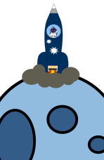
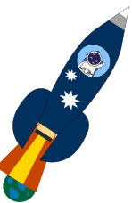

<!--- Copyright (C) Matrisk GmbH 2022 -->

(eee_family_guide)=
# Guide for EEE families

```{admonition} Under construction
:class: todo
The content of this page is missing and will be provided in a future version of the NRPM digital handbook.
```


<div id="conversation_eee_guide">
    <table>
        <tr>
            <td id="step_picture_cell">
                <div style="display: block;">
                    
                </div>
                <div style="display: block;">
                    
                </div>
                <div style="display: block;">
                    
                </div>
                <div style="display: block;">
                    
                </div>
            </td>
            <td id="conversation_track_eee_guide">
                <div id="messages_eee_guide" class="scroll-eee-guide">
                    <table class="track-eee-guide" id="messagesTrack_eee_guide">
                        <div class="question-line-eee-guide">What's your component's family ?</div>
                    </table>
                </div>
            </td>
        </tr>
    </table>
</div>
<script type="text/javascript">runEEEGuide();</script>