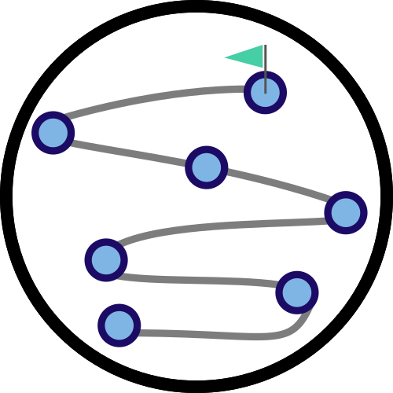
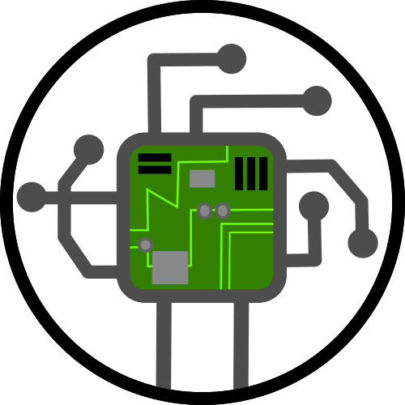

# Welcome to the {term}`NRPM` Digital Handbook !


This is the digital version of the [{term}`NRPM`](glossary_intro) handbook for reliability.space.

```{admonition} TIPS
:class: tip
You can find the table of contents just here on the left side, or you can look below and find [another one](toc) at the end of the page ! 
```

Here you can find help, calculation processes and fine graphical representations about [EEE](eee/mainEEE), [Mechanical](mechanical/handbook/introduction), [Miscellaneous](miscellaneous/handbook/introduction) and [RP at System Level](system/handbook/introduction) !

```{note}
If you have trouble with the acronyms, feel free to have a look on the [glossary](glossary_intro)
```

::::{grid}
:gutter: 3

:::{grid-item-card} **Methods**

:::

:::{grid-item-card} **Methodologies**

:::
::::

::::{grid}
:gutter: 3

:::{grid-item-card} **EEE**

:::

:::{grid-item-card} **Mechanical**

:::
::::

::::{grid}
:gutter: 3

:::{grid-item-card} **Miscellaneous**

:::

:::{grid-item-card} **System**

:::
::::


The present chapter explains the scope, structure and use of the handbook, with the objective to provide an introduction that is both short and useful from a handbook user’s perspective.

## Objective

The reliability.space 2020 handbook was developed during an {term}`ECSS` study aiming at the development of a {term}`reliability prediction <Reliability prediction>` methodology for space applications. The objective of the handbook is to provide a methodology that is dedicated to space, avoiding the limitations and shortcomings of existing {term}`reliability prediction <Reliability prediction>` methodologies which were largely focussing on ground applications. More details on the development of this reliability.space methodology can be found in [Annex A]().

## Scope

The objective of this handbook is to provide a methodology, methods and models for {term}`reliability prediction <Reliability prediction>` in space applications. The scope of the handbook can be explained by discussing the following terms:
- {term}`reliability prediction <Reliability prediction>`
- Space applications
- Methodology, methods and models

### {term}`reliability prediction <Reliability prediction>`

The term **{term}`reliability prediction <Reliability prediction>` (RP)** is here understood as the process, or outcome, of estimating (predicting) the reliability of a system or its components, i.e. the probability of success. In the more general context of {term}`RAMS` analyses, making use of qualitative and quantitative techniques, {term}`reliability prediction <Reliability prediction>` is restricted to providing quantitative estimates for the probability of success or failure. The focus of the methodology presented herein is on Reliability in this narrow sense. Specific .term}`requirement <Requirement>`s of Availability, Maintainability or Safety analyses have not been considered during the development of the methodology and are out of the handbook’s scope, even though the probabilistic methods provided may of course also be used to support these analyses.

### Space Applications

For the purpose of the Handbook, the term **Space Applications** refers to {term}`reliability prediction <Reliability prediction>`s for systems that operate in space, e.g. a {term}`spacecraft <Spacecraft>`. While parts of the methodology may also be used to model end-to-end systems including the ground segment, the handbook does not cover aspects specific to ground applications, e.g. related to the effect of ground environmental conditions. In terms of technology coverage, the methodology is limited to unmanned {term}`spacecraft <Spacecraft>` technology.

### Methodology, Methods and Models

The handbook includes a {term}`reliability prediction <Reliability prediction>` methodology for space applications together with information on the methods and models that can be used to perform the predictions.

```{figure} _static/images/figure1.png
---
width: 600px
name: Figure 1
---
Hierarchy of Methodology, Methods, Models and Data for {term}`reliability prediction <Reliability prediction>`s aiming at decision support and trade-offs in space projects. The practical implementation and tooling is not considered in the frame of the handbook.
```

{term}`reliability prediction <Reliability prediction>` is not an end in itself – the ultimate goal is decision support. A “decision” in this context should be understood as any kind of engineering, project management or business choice or trade-off, including e.g. feasibility assessments and design trade-offs, decisions during operations or for safe disposal, and business planning for single {term}`spacecraft <Spacecraft>`s or constellations.

The purpose of the handbook’s Methodology section (Part I) is to provide guidance for the use of {term}`reliability prediction <Reliability prediction>` to support such decisions. The ground rules and scope of the prediction are defined accounting for the RP objectives and uses as well as for the project life cycle phase in which the predictions are performed. Ultimately, the goal is to select suitable methods and models to perform a prediction in a given context.

The Methods section of the handbook (Part II) contains information about the inputs and modelling approaches that can be used to develop models for {term}`reliability prediction <Reliability prediction>`s in a given application. The discussion of methods forms the basis for the models presented thereafter, but can also be used to derive new models or update existing ones for future applications.
Models and data for {term}`reliability prediction <Reliability prediction>` in practical applications can be found in the Models section of the handbook (Part III).

Even though the handbook targets decision support, the decision-making as such is left to the user; {term}`reliability prediction <Reliability prediction>` is limited to providing the numbers that can be used to decide in a given trade-off situation. Also the practical implementation and development or choice of suitable Software tools is out of scope for the handbook. As a general rule, models are provided with full detail, allowing the development of tools without any restrictions regarding the information needed to implement the models.

## How to use the handbook

To simplify its application by the user, the handbook is divided in three volumes and a Preface:
The Preface contains terms and definitions, abbreviated terms and common nomenclature for all three volumes.

* Part I (Methodology) explains the framework and taxonomy used in this handbook and provides guidance for users that are in charge of planning a prediction.

* Part II (Methods) provides information on different modelling inputs and approaches, allowing to understand each model’s background and limitations, to update existing models with new data and to develop new models in consistency with the handbook philosophy.

* Part III (Models) defines the models and data to be used for {term}`reliability prediction <Reliability prediction>` in space applications.

Each volume has its intended audience, focussing on a specific use of the {term}`reliability prediction <Reliability prediction>` handbook, see {numref}`Figure 2`. for details. The average handbook user whose task is to perform a prediction with the given models will find all required material in Part III, which is divided by technical domain (EEE, Mechanical, Miscellaneous) and level (parts and small assemblies versus systems). It is, however, assumed that the user is familiar with the basic notions and concepts introduced in the other parts, e.g. the taxonomy explained in Part I.

```{figure} _static/images/figure2.png
---
width: 600px
name: Figure 2
---
Overview on the three handbook volumes and their usage by {term}`reliability prediction <Reliability prediction>` task.
```