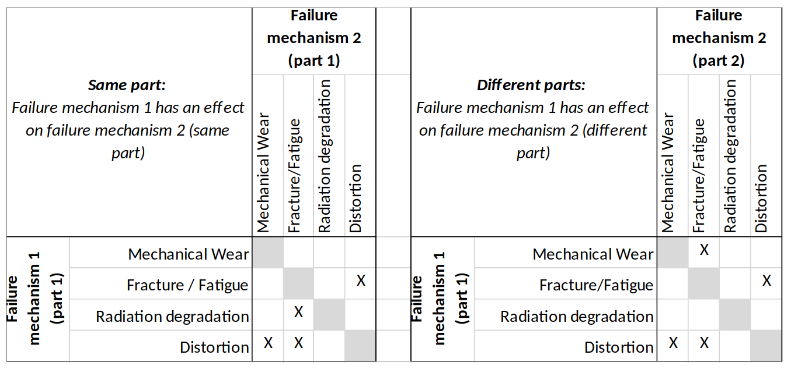

<!--- Copyright (C) Matrisk GmbH 2022 -->

(meca_9_5)=
# Method selection for different items and failure mechanisms

Once it is clear what needs to be considered in the {term}`reliability prediction <Reliability prediction>` (see {numref}`meca_9_4`), the next step is to decide how each part and {term}`failure mechanism <Failure mechanism>` should be modelled. The present section gives guidance on this method selection task.


(meca_9_5_1)=
## Categories and combinations of mechanical failure mechanisms

The method selection for mechanical parts reliability modelling modelling should always take basis in a good understanding of the failure mechanisms that are of relevance for the considered item, especially the predominant ones. To simplify the presentation in the following paragraphs, mechanical failure mechanisms are grouped into five distinct categories listed in {numref}`meca-table4-4`.

```{list-table} Categories of mechanical failure mechanisms
:name: meca-table4-4
:header-rows: 1

* - Failure mechanism category
  - Examples
* - Distortion
  - Creep, elastic deformation, plastic deformation, displacement
* - Fracture / Fatigue
  - Ductile / brittle fracture, high-cycle fatigue, low-cycle fatigue
* - Mechanical wear
  - Adhesive wear, abrasive wear, lubricated wear
* - Corrosion
  - Stress-corrosion cracking, galvanic corrosion
* - Material degradation
  - Thermal degradation, radiation damage

```

The probability of failure can for some items be driven by several different failure mechanisms. When using {term}`PoF` methods, the results for the individual mechanisms should be combined to estimate the overall part reliability. The correct way of doing this depends on whether the different failure mechanisms can be considered as independent processes or events.

For independent failure mechanisms, it is sufficient to consider one process at once, and to combine the results using normal probability calculus.
However, independence between different failure mechanisms cannot always be a valid assumption, e.g. in case of physical interactions between different failure mechanisms processes. {numref}`meca-table4-5` gives an overview for which combinations of failure mechanisms such effects can have to be considered. The table distinguishes interactions between different failure mechanisms affecting the same part (left hand side) and between different failure mechanisms affecting different parts (right hand side).


```{list-table} Possible interactions between different mechanical failure mechanisms
:name: meca-table4-5

* - 
```

A simple way to account for such interactions is to select the dominating failure mechanism (e.g. the one with the highest probability of failure) and to consider the effect of other failure mechanism(s) on the dominating failure mechanism. When using structural reliability methods, this can be achieved by adapting the basic variable distributions to account for physical effects related to other failure mechanism processes. 

The assessment then requires the following steps:

* Selection of the dominating failure mechanism, e.g. wear of a lubricated bearing.
* Identification of other failure mechanisms that can interact with the dominating failure mechanism using {numref}`meca-table4-5`, e.g. distortion of the membrane compressing the bearing.
* Identification of physical variables used by the model for the dominating failure mechanism that can be affected by the interaction, e.g. increase of the contact pressure in the bearing.
* Adjustment of the identified basic variables distributional models to account for the effect of the interaction, e.g. by considering the increased contact pressure..

Finally, it should be noted that besides physical interactions between failure mechanism, there are other possible reason for statistical dependence, such as common cause effects due to random physical variables (e.g. temperature, loads), influencing different failure mechanisms and/or parts. An example for explicit common cause modelling in a redundant bolted interface with load redistribution can be found in {cite:p}`mec-AO-1-8017-14-NL-KM`.


(meca_9_5_2)=
## Selection of methods for part level mechanical reliability prediction

The approach for method selection presented in the following is centred around the identified failure mechanisms, see {numref}`meca-table4_6` giving an overview of different mechanical part types with associated failure mechanisms and modelling recommendations. 

The third column of {numref}`meca-table4_6` gives an indication about the relevance of each part type for different classes of mechanical systems introduced in  {numref}`meca-table4-3`. As has been discussed in {numref}`meca_9_4`, it can be sufficient to focus on those parts that dominate system level reliability. In the same way, the reliability of a specific part is often dominated by a single (or very few) failure mechanism(s), allowing to focus the analysis especially with methods that are based on the PoF. 
Which failure mechanism(s) dominates reliability depends not only on the part type, but also on the application, e.g. a spring is likely to fail differently when used with static, cyclic or dynamic loading. The “predominant” failure mechanisms listed in {numref}`meca-table4_6` should therefore be considered only as a first guidance.

The remaining columns of {numref}`meca-table4_6`provide recommendations on the modelling of the selected parts and failure mechanisms. The focus is on the methods making reference to the PoF, in particular Structural reliability methods as outlined in {numref}`meca_9_6` and {numref}`meca_9_7`. 

The application of the handbook approaches is restricted to selected parts, allowing the possible use of the {term}`NSWC` handbook {cite:p}`mec-NSWC-11` as a scaling method (which is based the {term}`physics of failure <Physics of failure>`) to adapt statistical estimates based on data samples that are more relevant for space applications than the {term}`NSWC` data, see {numref}`meca_9_3_1_5` for discussion. The {term}`NPRD` Handbook {cite:p}`mec-NPRD-16` is not considered any further. 

In {numref}`meca-table4_6`, statistical methods are mentioned only where a prediction based on a pure PoF approach is unlikely to be successful. However, as has been discussed already in {numref}`meca_9_3_2`, , statistical methods are generally preferred over PoF approaches provided that sufficient and relevant data is available to perform the prediction. The failure mechanisms listed in {numref}`meca-table4_6` can provide guidance for judging the relevance of a specific data set, always keeping in mind the strong variability in mechanical parts reliability when seemingly identical parts are applied under different conditions.

Also, a combined approach with Bayesian updating of a prior derived from the PoF, using relevant data even with limited sample size, is generally preferred over a pure PoF approach, see {numref}`meca_9_3_2_4` and {numref}`meca_9_6_5` for guidance.

<input type="text" class="myInput" id="myInput" onkeyup="searchTableJupyter(this, 'meca-table4_6')" placeholder="Search table...">

```{list-table} Mechanical part types, associated failure mechanisms and modelling recommendations
:name: meca-table4_6

* - <table id="meca-table4_6" class="myTable" overflowY="scroll">
		<thead>
			<tr class="db-header">
				<th colspan="5"></th>
				<th colspan="3">Structural reliability methods</th>
				<th colspan="2">NSWG 2011 handbook</th>
			</tr>
			<tr class="db-header">
				<th>Part type</th>
				<th>Description</th>
				<th>Mechanical item category</th>
				<th>Predominant failure mechanism</th>
				<th>Modelling recommendation</th>
				<th>Potential failure mechanisms</th>
				<th>Limit state function</th>
				<th>Simplified method</th>
				<th>Model available</th>
				<th>Space relevance of NSWC method</th>
			</tr>
		</thead>
		<tr>
			<td>Bearings</td>
			<td>A device that constrains relative motion to only the I Active desired motion, and reduces friction
				between moving parts</td>
			<td>I Active</td>
			<td>Lubrication wear</td>
			<td>Structural reliability methods</td>
			<td>
				<p><u>Wear</u></p>
				<p>Fatigue &fracture</p>
				<p>Distortion</p>
			</td>
			<td>
				<p><i class="fa fa-check" style="color:green"></i></p>
				<p><i class="fa fa-check" style="color:green"></i></p>
				<p>generic</p>
			</td>
			<td>
				<p><i class="fa fa-check" style="color:green"></i></p>
				<p><i class="fa fa-check" style="color:green"></i></p>
				<p><i class="fa fa-times" style="color:red"></i></p>
			</td>
			<td>
				<p><i class="fa fa-check" style="color:green"></i></p>
			</td>
			<td>Method not applicable due to predominance of lubrication wear over fatigue in space</td>
		</tr>
		<tr>
			<td>Springs</td>
			<td>An elastic object that stores mechanical energy, II Passive used to exert forces or to provide flexibility.</td>
			<td>II Passive</td>
			<td>Load loss, creep (distortion)</td>
			<td>Statistical methods, NSWC adjusted, or Structural (but  difficult to model creep)</td>
			<td>
				<p>Fatigue &fracture</p>
				<p><u>Distortion</u></p>
			</td>
			<td>
				<p><i class="fa fa-check" style="color:green"></i></p>
				<p><i class="fa fa-times" style="color:red"></i></p>
			</td>
			<td>
				<p><i class="fa fa-check" style="color:green"></i></p>
				<p><i class="fa fa-times" style="color:red"></i></p>
			</td>
			<td>
				<p><i class="fa fa-check" style="color:green"></i></p>
			</td>
			<td>Depends on the type and application; fatigue/fracture less relevant in space</td>
		</tr>
		<tr>
			<td>Gears and splines</td>
			<td>A toothed machine part such as a wheel or cylinder I Active that meshes with another toothed part to transmit motion or to change speed or direction</td>
			<td>I Active</td>
			<td>Lubrication wear</td>
			<td>Structural reliability methods</td>
			<td>
				<p><u>Wear</u></p>
				<p>Fatigue &fracture</p>
				<p>Distortion</p>
			</td>
			<td>
				<p><i class="fa fa-check" style="color:green"></i></p>
				<p><i class="fa fa-check" style="color:green"></i></p>
				<p>generic</p>
			</td>
			<td>
				<p><i class="fa fa-check" style="color:green"></i></p>
				<p><i class="fa fa-check" style="color:green"></i></p>
				<p><i class="fa fa-times" style="color:red"></i></p>
			</td>
			<td>
				<p><i class="fa fa-check" style="color:green"></i></p>
			</td>
			<td>Application questionable due to space specific lubrication and rotation speeds</td>
		</tr>
		<tr>
			<td>Shafts</td>
			<td>A rotating device, usually of circular cross section that transmits torque from one part to another</td>
			<td>I Active</td>
			<td>Wear (when contact is present),otherwise fatigue</td>
			<td>Structural reliability methods</td>
			<td>
				<p><u>Wear</u></p>
				<p>Fatigue &fracture</p>
				<p>Distortion</p>
			</td>
			<td>
				<p><i class="fa fa-check" style="color:green"></i></p>
				<p><i class="fa fa-check" style="color:green"></i></p>
				<p>generic</p>
			</td>
			<td>
				<p><i class="fa fa-check" style="color:green"></i></p>
				<p><i class="fa fa-check" style="color:green"></i></p>
				<p><i class="fa fa-times" style="color:red"></i></p>
			</td>
			<td>
				<p><i class="fa fa-check" style="color:green"></i></p>
			</td>
			<td>Method is maintenance related and thus not applicable to space</td>
		</tr>
		<tr>
			<td>Hinges</td>
			<td>Ajoint that holds two parts together such that one II Passive can swing relative to the other</td>
			<td>II Passive</td>
			<td>Increased friction or kinematic issues</td>
			<td>Structural reliability methods</td>
			<td>
				<p><u>Distortion</u></p>
				<p>Wear</p>
			</td>
			<td>
				<p>generic</p>
				<p><i class="fa fa-check" style="color:green"></i></p>
			</td>
			<td>
				<p><i class="fa fa-times" style="color:red"></i></p>
				<p><i class="fa fa-check" style="color:green"></i></p>
			</td>
			<td>
				<p><i class="fa fa-check" style="color:green"></i></p>
			</td>
			<td>Only some general considerations in NSWC</td>
		</tr>
		<tr>
			<td>Mirrors and lenses</td>
			<td>A piece of glass or similar material designed to reflect (mirror), or to concentrate or disperse light rays.</td>
			<td>IV Structural</td>
			<td>Fracture</td>
			<td>Structural reliability methods</td>
			<td>
				<p><u>Fatigue &fracture</u></p>
				<p>Distortion</p>
				<p>Degradation</p>
			</td>
			<td>
				<p><i class="fa fa-check" style="color:green"></i></p>
				<p>generic</p>
				<p><i class="fa fa-check" style="color:green"></i></p>
			</td>
			<td>
				<p><i class="fa fa-check" style="color:green"></i></p>
				<p><i class="fa fa-times" style="color:red"></i></p>
				<p><i class="fa fa-check" style="color:green"></i></p>
			</td>
			<td>
				<p><i class="fa fa-times" style="color:red"></i></p>
			</td>
			<td>NA</td>
		</tr>
		<tr>
			<td>Flexural pivots</td>
			<td>A flexure which is engineered to be compliant in one or more angular degrees of freedom.</td>
			<td>
				<p>I Active</p>
				<p>II Passive</p>
			</td>
			<td>Fatigue</td>
			<td>Structural reliability methods</td>
			<td>
				<p><u>Fatigue &fracture</u></p>
			</td>
			<td>
				<p><i class="fa fa-check" style="color:green"></i></p>
			</td>
			<td>
				<p><i class="fa fa-check" style="color:green"></i></p>
			</td>
			<td>
				<p><i class="fa fa-times" style="color:red"></i></p>
			</td>
			<td>NA</td>
		</tr>
		<tr>
			<td>Fusible Wires</td>
			<td>A device consisting of metal strips soldered with a fusible alloy that melts at a specific temperature, allowing the pieces to separate</td>
			<td>II Passive</td>
			<td>Quality issue or random failure</td>
			<td>Statistical methods</td>
			<td>
				<p>Fatigue &fracture</p>
				<p>Distortion</p>
			</td>
			<td>
				<p><i class="fa fa-check" style="color:green"></i></p>
				<p>generic</p>
			</td>
			<td>
				<p><i class="fa fa-check" style="color:green"></i></p>
				<p><i class="fa fa-times" style="color:red"></i></p>
			</td>
			<td>
				<p><i class="fa fa-times" style="color:red"></i></p>
			</td>
			<td>NA</td>
		</tr>
		<tr>
			<td>Seals and Gaskets</td>
			<td>A device placed between two surfaces to prevent the flow of gas or fluid from one region to another</td>
			<td>
				<p>I Active</p>
				<p>II Passive</p>
				<p>III Fluidic</p>
			</td>
			<td>Wear, degradation, installation damage</td>
			<td>NSWC adjusted, Statistical methods or Structural reliability methods</td>
			<td>
				<p><u>Wear</u></p>
				<p>Distortion</p>
				<p>Degradation</p>
			</td>
			<td>
				<p><i class="fa fa-check" style="color:green"></i></p>
				<p>generic</p>
				<p><i class="fa fa-times" style="color:red"></i></p>
			</td>
			<td>
				<p><i class="fa fa-check" style="color:green"></i></p>
				<p><i class="fa fa-times" style="color:red"></i></p>
				<p><i class="fa fa-times" style="color:red"></i></p>
			</td>
			<td>
				<p><i class="fa fa-check" style="color:green"></i></p>
			</td>
			<td>Method may be applicable but requires base failure rate adjustment</td>
		</tr>
		<tr>
			<td>Structural component (ind.threaded fasteners,inserts, brackets)</td>
			<td>A mechanical component designed to sustain loads or pressures, provide stiffness or stability, or
				provide support or containment.</td>
			<td>IV Structural</td>
			<td>Fracture</td>
			<td>Structural reliability methods</td>
			<td>
				<p><u>Fatigue &fracture</u></p>
				<p>Distortion</p>
			</td>
			<td>
				<p><i class="fa fa-check" style="color:green"></i></p>
				<p>generic</p>
			</td>
			<td>
				<p><i class="fa fa-check" style="color:green"></i></p>
				<p><i class="fa fa-times" style="color:red"></i></p>
			</td>
			<td>
				<p><i class="fa fa-times" style="color:red"></i></p>
			</td>
			<td>NA</td>
		</tr>
	</table>
```

(meca_9_5_3)=
## Selection of methods for assembly level mechanical reliability prediction
Reliability prediction for assemblies of mechanical parts can either be made bottom-up, combining part level inputs with system level reliability methods, or top-down, using inputs directly collected at the level of the considered assembly. In general, similar considerations apply as for part level mechanical reliability prediction, leading to the following modelling recommendations:

* **Statistical (or combined) methods** are suitable provided that relevant failure data is available directly at the level of the considered assembly.
* **Physics of failure methods** based on Structural reliability theory are suitable if the assembly level probability of failure is dominated by one or very few {term}`failure mechanisms <Failure mechanism>` (see also the discussion in {numref}`meca_9_4`).
* **Bottom-up modelling** starting from part level analysis is recommended in case none of the abovementioned conditions is fulfilled.


```{admonition} Note
:class: note
The NSWC Handbook {cite:p}`mec-NSWC-11` contains models also for some items that are better considered as assemblies rather than parts, including e.g. electric motors, solenoids and transducers. 

For reasons already discussed in {numref}`meca_9_3_1_5`, , the direct use of these models is not recommended for space applications.

