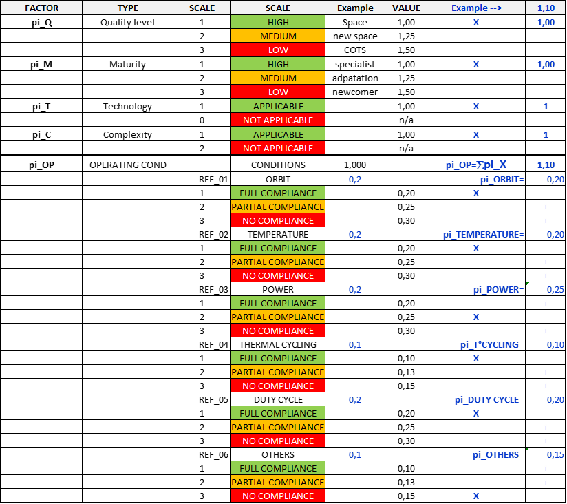
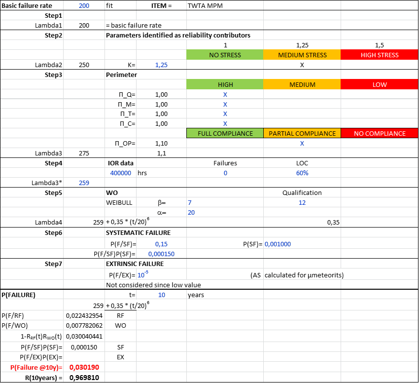

<!--- Copyright (C) Matrisk GmbH 2022 -->

(misc_10_5)=
# Process for reliability modelling

This section details how to build a reliability model for {term}`miscellaneous items <Miscellaneous item>`. {numref}`Figure_5_4` provides the general process to apply whatever the basic model is: 

1. the “standard model”, or 
2. the “non-standard model” or even, 
3. the “holistic model”.

```{admonition} Note 
:class: note
On {numref}`Figure_5_4`, the basic model is a failure rate but it could also be a probability of failure.
```


```{figure} ../../picture/figure4_4.png
---
width: 600px
name: Figure_5_4
---
General process for miscellaneous items reliability prediction
```

First, it is necessary, before starting anything, to collect/define all technical information about the miscellaneous item in order to select the category of miscellaneous item which will be used, if relevant, as a “standard model”:

*	Functional analysis: list of all the main functions supported by the item,
*	Technical performances: list of all the specified performances regarding the nominal mission / the reduced mission, 
*	Hardware description:  functional breakdown and hardware architecture as per reliability block diagram (refer to the reliability analysis and associated {term}`FMEA`),
*	Trajectory ({term}`GEO`, {term}`LEO`, {term}`MEO`, interplanetary orbit) on which the item is intended to be used,
*	Operating conditions,
*	Duty cycle,
*	Voltage current,
*	Thermal environment,
*	Flight experience: the maturity of the item regarding in-orbit background.

The basic principle is to provide through a reference failure rate (or a probability of failure for one-shot devices) and to up-date this reference failure rate as relevant considering the contributors (multiplying corrective factors) to the probability of failure. In the following paragraph, the general process is described.

Note that it is considered that the multiplying corrective factor is also used to up-date the probability of failure in the case of a one-shot device, based on the fact that, for constant failure rate, when the probability of failure can be approximated by $\lambda t$ (i.e. for exponential distribution in the case $\lambda t < 10^{-2}$) the corrective factor $K$ leads to a new probability = $K t$, which means the probability of failure is multiplied by the corrective factor.
As a result, the same applies for the probability of failure P_f for a one-shot device: the basic probability can be amended by a factor $K$, leading to $K P_{F}$.

So, what is discussed in the following paragraphs, addressing directly the failure rate, applies for the probability of failure for one-shot device.


(misc_step1)=
``````{dropdown} **STEP 1 : Selection of the initial model**

The basic principle is to start from a reference failure rate, either derived from in-orbit data in the frame of this handbook or from a “non-standard model” duly justified by the supplier.

`````{admonition} Rule
:class: rule
**$\bf{JO1_{Rule}}$**: The supplier provides the rationale supporting the use of a “model” (functional analysis, hardware configuration, operating conditions) providing as a minimum:

* Miscellaneous category,
* List of the main functions / main performances,
* Operating conditions range.

The failure rate is referred to, at 60% {term}`level of confidence <Level of confidence>`, as basic failure rate:

````{admonition} Equation
:class: equation
```{math}
:label: Equation_5_1
\lambda_{1} = \lambda_{B}
```
````

`````
``````


(misc_step2)=
``````{dropdown} **STEP 2 : Normalization of the basic failure rate**

The major contributors to the reliability are identified in {numref}`misc-table_10_8`.
In the case the actual parameters are different (either higher or lower quality levels, additional stresses, specific technology, specific contributors to the reliability) a tailoring factor is recommended to account for the item’s specificities.

The resulting failure rate is: 

`````{admonition} Rule
:class: rule
**$\bf{JO2_{Rule}}$**: The supplier identifies the physical parameters contributing to the reliability and accounting for the item specificities.
 

````{admonition} Equation
:class: equation
```{math}
:label: Equation_5_2
\lambda_{2} = \lambda_{1} * K_{parameters}
```
````

By default, $K_{parameters}$ is set to 1, under the condition that the major contributors are sufficiently close to those defined for the basic failure rate.
It is the responsibility of the user (the supplier) to adapt and/or define the $K_{parameters}$ as relevant with appropriate technical justification.
`````
``````
<a id="back_from_misc_failure_rate_processing_balise"></a>
(misc_step3)=
``````{dropdown} **STEP 3 : Consideration of reliability contributors**
The basic failure rate which is derived from IOR relates to a certain set of assumptions likely to impact the reliability. It is therefore necessary to amend as relevant the basic failure rate to account for the real conditions of the item under consideration.

<a href="../../models/failure_rate_processing.html" class="back-forward-button" id="back_from_misc_failure_rate_processing_balise_button">Go to model</a>

* **$\Pi_{Q}$ = Quality factor**
  
  This factor covers the quality level used to design/manufacture the miscellaneous item. It addresses the quality process, as a whole, as defined in the {term}`ECSS` frameDEGrk. A three level scale is used:

  * **Level 1** = High quality (e.g. most of telecommunications satellites)
  
    The technical risk is mitigated / cancelled as necessary. This level refers to the high-quality standard used for space (refer to ECSS).

  * **Level 2** = Medium quality (e.g. New space paradigm)
  
    The technical risk is optimized. This level is an intermediate level between high quality level and low-quality level.

  * **Level 3** = Low quality (e.g. COTS without quality space standard requiring specific qualification)
  
    The technical risk is mitigated up to the cost target, otherwise accepted.

`````{admonition} Rule
  :class: rule
  **$\bf{JO3_{rule}}$**: The supplier justifies with technical argument the quality level of the miscellaneous item providing the quality reference as define in the Product Assurance requirements applicable to the miscellaneous item.
`````

 * **$\Pi_{M}$ = Maturity factor**
  
  This factor addresses the maturity level of the supplier. A three level scale is used:

  * **Level 1** = High maturity
  
    The supplier is a specialist providing the space stakeholders with the miscellaneous item.

  * **Level 2** = Medium maturity
  
    The item is a new development for the supplier.

  * **Level 3** = Low maturity (e.g. {term}`COTS` without quality space standard requiring specific qualification)
  
    The supplier is a newcomer on the market to develop such a product.

  `````{admonition} Rule
  :class: rule
  **$\bf{JO4_{rule}}$**: The supplier justifies with technical arguments the maturity level of the miscellaneous item providing evidence of the related ranking.
  `````        

* **$\Pi_{T}$ = Technology factor**
  
  This factor relates to the “technology” supporting the item. “Technology” is considered in a wide sense and is already addressed in the IOR equivalent class from which the basic failure rate is derived. No assumption can really be defined to account for the use of a new technology or a technology slightly different. The supplier justifies with technical arguments the reason why the technology of its product matches the technology accounted in the basic failure rate. If it is not the case, a “non-standard model” is developed by the supplier, e.g. {term}`SSPA` implements a different technology than {term}`TWTA` and therefore the reliability model used for TWTA will not be used for SSPA.

`````{admonition} Rule
  :class: rule
  **$\bf{JO5_{rule}}$**: The supplier justifies that the technology supporting the item is consistent with the IOR data used as a basis to determine the basic failure rate.
`````        

* **$\Pi_{C}$ = Complexity factor**
  
 Reliability depends on the complexity of the item. The assessment of the complexity is difficult. The supplier justifies with technical arguments the reason why the complexity of its product is consistent with the complexity accounted in the basic failure rate. If it is not the case a “non-standard model” is developed by the supplier.


`````{admonition} Rule
  :class: rule
  **$\bf{JO6_{rule}}$**: The supplier justifies that the complexity (design) supporting the item is consistent with the IOR data used as a basis to determine the basic failure rate.
`````        

* **$\Pi_{OP}$ = Operating conditions factor**
  
  The factor represents the frame of the significant operating conditions of the item. It is item dependent.

  * Orbit,
  * Temperature,
  * Power,
  * Thermal Cycling,
  * Duty cycle,
  * Other relevant conditions considered as reliability contributor. 

`````{admonition} Rule
:class: rule
**$\bf{JO7_{rule}}$**: The supplier identifies with adequate justification the parameters / stresses impacting the reliability with an associated weight representing the contribution of the parameter to the reliability.
`````        

`````{admonition} Rule
  :class: rule
  **$\bf{JO8_{rule}}$**: The supplier classifies each significant condition in three categories:

  * **Fully compliant**: The basic failure rate has been derived for the same operating conditions (with respect to this parameter),
  * **Partially compliant**: The basic failure rate has been derived based on different operating conditions and the parameter is assumed to be a contributor to the reliability with medium impact,
  * **Not compliant**: The basic failure rate has been derived based on different operating conditions and the parameter is assumed to be a contributor to the reliability with high impact.
`````    

The weighting factor attributed per condition represents the contribution of each condition to the reliability of the item. The average resulting factor is then applied.

The resulting failure rate is:

````{admonition} Equation
:class: equation

```{math}
:label: Equation_5_3
\lambda_{3} = \lambda_{2} * \Pi_{Q} * \Pi_{M} * \Pi_{CT} * \Pi_{C} * \Pi_{OP}
```
````
```{admonition} Note 
:class: note
For operating conditions, it is necessary to define the weights per contributor and to add a number of conditions as necessary. The process is:

* To define the number of conditions
* To attribute a weighting factor per condition
* To define the category for each condition
* To calculate the resulting factor to be added.

{numref}`misc-table_10_4` provides an example of such a calculation. 
```


```{list-table} Values of factors per their ranking
:name: misc-table_10_4

* - 
```

```{admonition} Note 
:class: note
The column “value” provides the factors depending on the classification (column “scale”).
```

```{admonition} Note 
:class: note
The tDEG right-hand columns provide the result for one example (“X” representing the ranking regarding the different categories with the associated resulting factor in the right column).

$1.1 = 1.00 * 1.00 * 1 * 1 * 1.1 = \Pi_{Q} * \Pi_{M} * \Pi_{CT} * \Pi_{C} * \Pi_{OP}$

```
``````


(misc_step4)=
``````{dropdown} **STEP 4 : Application of combined approach**

Step 4 is used to combine the predicted failure rate with IOR data in the case the item is based on a generic product which is already operated in-orbit.

The method used is the Bayesian approach as presented in  {numref}`misc_10_6_3`.

````{admonition} Equation
:class: equation
```{math}
:label: Equation_5_4
\lambda_{3}^{\gamma} = \lambda_{3}
```
Where, $\lambda_{3}^{\gamma}$ is the gamma estimator.
````
``````

(misc_step5)=
``````{dropdown} **STEP 5 : Degradation modelling**
Step 5 incorporates in the reliability model the failures due to potential degradation, as necessary.
The model consists in combining random failure probability and degradation failure probability.  Let’s denote:

* $T_{TF}$ as the Time To Failure random variable,
* $T_{RF}$ is the TTF representing random failures (constant failure rate for miscellaneous items),
* $T_{RF}$ is modelled by the exponential distribution,
* $T_{DEG}$ is the TTF representing degradation failures (increasing failure rate).

Note that $T_{DEG}$ can be modelled by any distribution with increasing failure rate, i.e. Weibull W($\beta, \eta$), normal ($m, \sigma$), lognormal… as relevant (based on the supplier knowledge). But another efficient way to access this data is to access directly to the degradation model. A degradation model can be defined as the evolution of a physical parameters along the time. If we define the limit value of the parameter below which the expected function is not anymore performed, we have defined a failure threshold and the associated time is the associated $T_{TF}$. Depending on the uncertainties an accuracy of the degradation model, it is also possible to define uncertainties limits around the $T_{TF}$.

On the basis of such a degradation model, it is possible to define:

* **${RUL(t)}$: Remaining Useful Life at time t.**


The RUL is a random variable, function of time, representing the remaining time for asset before the failure. 

* **${MRL(t)}$: Mean Residual Life**

The MRL is the mathematical expectation of the RUL. Thus, $MRL(t)$ defines the average ageing trend in a population consisting in many identical assets.

It is possible to access to the \lambda(t) and $R(t)$ by using mathematical relations. In particular, the MRL and the failure rates are linked by the following differential equation:

$\frac{dMRL(t)}{dt} = \lambda(t) \cdot MRL(t) - 1$

With:

$\lambda(t) = \frac{-R'(t)}{R(t)}$

Three models are presented to model include degradation mechanisms and impacts on the reliability of the item:

* **MODEL 1**: $RF$ model and $DEG$ model are combined from $t=0$, based on $T = TTF = min(T_{RF}, T_{DEG})$
* **MODEL 2**: $RF$ model and $DEG$ model are combined beyond $\theta$, assumed to be the qualification time (laps of time defined in accordance with the technical. Requirements, agreed with the customer, in order to demonstrate the capability of an item to withstand the applied stresses all along the specified lifetime without significant degradations preventing from the mission achievement).
* **MODEL 3**: $RF$ distribution and $DEG_{PDF}$ are separated @ $\alpha$ ($RF$ before, $DEG$ beyond) from $\lambda_{DEG}(\alpha)=\lambda_{RF}$

All three models can be defined for every degradation probability density function: normal, lognormal, gamma … with adequate properties.


`````{admonition} Rule
:class: rule
**$\bf{JO9_{rule}}$**: The supplier justifies the degradation model based on the qualification characteristics of the item.

The resulting failure rate is :

````{admonition} Equation
:class: equation
```{math}
:label: Equation_5_5
\lambda_{4}(t) = \lambda_{3}^{\gamma} + \lambda_{DEG}(t)
```
````

The {term}`reliability prediction <Reliability prediction>` of the item is then provided by:

````{admonition} Equation
:class: equation
```{math}
:label: Equation_5_6
P(\text{FAILURE}) = 1 - e^{-\int_{0}^{t} \lambda_{4}(u) \, \mathrm{d}u}
```
````
`````

**Discussion about the three models**

{numref}`Figure_5_5` presents the differences on the reliability and on the failure rates per model 1, 2, 3, using the example of the Weibull distribution as a wear-out model.

* Model 1 and model 3 are very close since the constant failure rates used for miscellaneous items are very low regarding the increasing failure rates of any distribution such as normal or Weibull distribution.
* Model 2 could be considered as optimistic since it addresses degradation only after the qualification time.
* Model 1 appears as the most appropriate, summing the constant failure rate for random failures modelling and the increasing failure rate for degradation failure modelling. It is recommended to be used except technical arguments support another choice.


```{figure} ../../picture/figure4_5.png
---
width: 600px
name: Figure_5_5
---
Failure rates for the three degradation models (exponential, Weibull)
```

**Guidance to derive the degradation distribution characteristics**

In the case there is no data to support the selection of a degradation failure time distribution and the associated parameters, it is recommended to apply the following process.

The first assumption is to consider a normal distribution. The user should have to determine:

* The qualification time (e.g. 10 years or equivalent) $\text{t}_{\text{Q}}$ , by default it is the specified lifetime.
* A level a of quality (a=1, 2 or 3) represented by 
  * 1$\sigma$: P(T> m-1$\sigma$) = 84,1%
  * 2$\sigma$: P(T> m-2$\sigma$) = 97,7% 
  * 3$\sigma$: P(T> m-3$\sigma$) = 99,85%
depending on the level of quality of the qualification.

* A ratio $v = \sigma/m (\sigma=vm)$ representing the variability of the manufacturing process, 10% is recommended by default (to be justified considering the quality of the manufacturing process).


Then the characteristics are calculated:

$m – a\sigma=m-avm =t_{Q}$

$m = t_{Q}/(1-av)$

$\sigma= vm$

Knowing $m$ and $\sigma$, the distribution $N(m,\sigma)$ is completely defined and the resulting functions $\text{R}_{\text{DEG}}(t)$, $\text{F}_\text{T}(t)$, $\text{f}_\text{T}(t)$ and $\lambda_{\text{DEG}}(t)=\text{f}_\text{T}(t)/\text{R}_{\text{DEG}}(t)$ are defined likewise.

It is possible also to derive a Weibull distribution, similarly to the normal distribution by adapting the tDEG parameters $\beta$ and $\alpha$ of the Weibull distribution in order to match the expected value m and the standard-deviation $\sigma$.

Then the probability $\text{P} (\text{T} > \text{t}_{\text{Q}})$ provides the {term}`Level of Confidence <Level of confidence>` (LoC), i.e. $\text{R}_{\text{DEG}}(t) (\text{t}_{\text{Q}})$

```{admonition} Note 
:class: note
When the parameters are consistent the reliability function is similar between the normal distribution and the Weibull distribution. {numref}`Figure_5_6` (resp. {numref}`Figure_5_7`) presents an example of such calculation with normal law (resp. Weibull).
```

```{figure} ../../picture/figure4_6.png
---
width: 600px
name: Figure_5_6
---
Example of {term}`DEG` distribution calculation (assumption: normal distribution)
```

```{figure} ../../picture/figure4_7.png
---
width: 600px
name: Figure_5_7
---
Example of {term}`DEG` distribution calculation (assumption: Weibull distribution)
```
``````


(misc_step6)=
``````{dropdown} **STEP 6 : Systematic failures modelling**

The step 6 consists in adding a probability of failure related to {term}`systematic failures <Systematic failure>`.

````{admonition} Equation
:class: equation
```{math}
:label: Equation_5_7
P(\text{FAILURE}) = 1 - (1 - SF) * (1 - e^{-\int_{0}^{t} \lambda_{4}(u) \, \mathrm{d}u})
```
````

The model is common to all miscellaneous items (refer to {ref}`Part 6 – System <sec_sys_handbook>` of this handbook for defining the {term}`SF` value). 

``````


(misc_step7)=
``````{dropdown} **STEP 7 : Extrinsic failures modelling**

The step 7 consists in adding a probability of failure related to the external particles.

````{admonition} Equation
:class: equation
```{math}
:label: Equation_5_8
P(\text{FAILURE}) = 1 - \left(1 - EX\right) * \left(1 - SF\right) * \left(1 - e^{-\int_{0}^{t} \lambda_{4}(u) \, \mathrm{d}u}\right)
```
````

The probability of {term}`extrinsic failures <Extrinsic failure>` {term}`EX` is dependent on:

1. The item location (outside the satellite), 
2. The probability to be hit by a particle (refer to µmeteorits flux and characteristics depending on the orbit, on the position on the orbit and on the velocity vector) and 
3. The shielding for the item protection.
  
The definition of a model representing the probability to be hit by a debris is out of the scope of the current document (refer to {ref}`Part 4 - MEC <sec_mech_handbook>` of this handbook for more information).
``````


**Result after completing Step 1 to Step 7**

The method allows deriving a reliability function in time as presented here above.

It is up to the discretion of the user to use the result appropriately:

* Probability of failure,
* Probability of success,
* Equivalent failure rate derived at a certain time (only valid at this time),
* Approximation of the probability of failure by $\lambda t$, when $\lambda$ is small regarding $10^{-2}$.
  
An example of calculation is presented in {numref}`misc-table_10_5`.

```{list-table} Example of a reliability calculation for a miscellaneous item: TWTA
:name: misc-table_10_5

* - 
```
