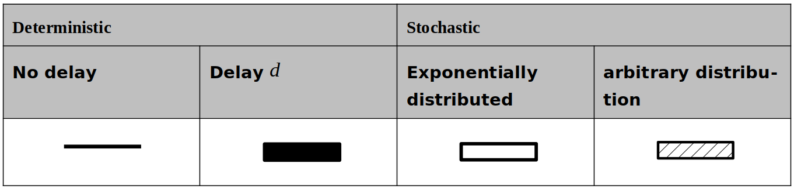
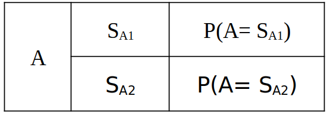
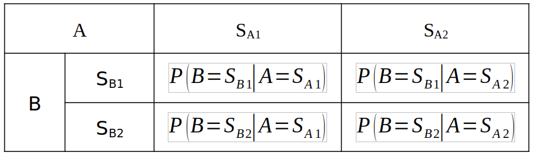

<!--- Copyright (C) Matrisk GmbH 2022 -->

(syst_11_3)=
# System level methods 

This section presents various system reliability modelling techniques such as reliability block diagrams ({term}`RBD`), fault tree analysis ({term}`FTA`), Markov models, Petri networks and Bayesian networks. The presented methods have in common that they aim at evaluating system reliability as a function of the constituting elements. All methods could be used for comparison of different design solutions and system architectures. The following table provides an overview of the different methods, indicating when which method should be used and also what limitation are associated with each of them.

<Input type="text" class="myInput" id="myInput" onkeyup="searchTableJupyter(this, 'syst-table_11_2')" placeholder="Search table...">

```{list-table} Overview of system level methods
:name: syst-table_11_2
:header-rows: 1
:widths: 10 30 30 30

*   - Method
    - Use cases
    - Remarks
    - Inputs/outputs
*   - **RBD** See {numref}`syst_11_3_1`, **{term}`FTA`** See {numref}`syst_11_3_2`
    - They are well suited for systems with non-repairable components following independent behaviour. The methods RBD and {term}`FTA` should be used for system reliability analysis if the system can be represented as a serial or parallel arrangement or a combination of both without dependencies. 
    - <p>Repair, sequences, re-configuration and dependencies cannot be modelled.</p><p>The calculation rules are identical for RBD and FTA, just the graphical presentation of the system behaviour is different.</p>
    - <p>**Input**s: System architecture, component or subsystem failure rates/reliabilities</p><p>**output**: System reliability</p>
*   - **Event Tree Analysis** See {numref}`syst_11_3_3`
    - Analyse the sequence of events following an initiating event.
    - Only one initiating event can be analysed in each analysis. Difficult to analyse common cause failures (CCF). 
    - <p>**Input**: List of initiating event, additional event and barriers/mitigations means. Probabilities of events</p><p>**output**: Probability of certain consequences depending on initiating event</p>
*   - **Markov Process modelling** See {numref}`syst_11_3_4`
    - State space based, Markov should be used to analyse repairable system, reconfigurations and dynamic behaviour.
    - Markov uses constant failure rates/repair rates. The model size increases rapidly with number of components, for $n$ components, there are $2^{n}$ system states. 
    - <p>**Input**: System architecture, Dynamic system behaviour, Transition rates</p><p>**output**: State probability</p>
*   - **Petri network** See {numref}`syst_11_3_5`
    - <p>Dynamic behaviour can be analysed.</p><p>Deterministic and stochastic transitions. Petri nets should be used to model the various states of the system and how it evolves from one state to another when events occur.</p>
    - Not limited to constant transition rates and transition diagram might be easier to model compared to Markov as less subject to combinatory explosion of states. 
    - <p>**Input**s: System architecture, Dynamic system behaviour, Transitions (deterministic, arbitrary distribution)</p><p>**output**: Probability of certain states/transitions</p>
*   - **Bayesian networks** See {numref}`syst_11_3_6`
    - Directed acyclic graphs represent explicitly dependencies, status of child node depending on status of parent nodes. Allows modelling of dependencies.
    - <p>Allows merging knowledge of diverse natures (in-service data, expert knowledge, etc.).</p><p>Allows modelling of Common Cause Failure (CCF) through explicit modelling of dependencies.</p>
    - <p>**Input**: Set of random variables and causal relationships between them expressed as conditional probability table</p><p>**output**: Probability of certain random variables</p>
```

Depending on the specific characteristics that should be represented in the system model, different system level methods are more suitable than others. To select the most appropriate method for the system level reliability prediction, {numref}`syst-table_11_3` provides an overview of each model’s scope of application.

<Input type="text" class="myInput" id="myInput" onkeyup="searchTableJupyter(this, 'syst-table_11_3')" placeholder="Search table...">

```{list-table} Selection of system level methods
:name: syst-table_11_3
:header-rows: 1
:widths: 30 10 10 10 10 10 10

* - System model characteristics
  - RBD
  - FTA
  - Event Tree
  - Markov
  - Petri network
  - Bayesian network
* - Random failure
  - ●
  - ●
  - ●
  - ●
  - ●
  - ●
* - Dependent component failures
  - ×
  - ×
  - ×
  - ○
  - ○
  - ●
* - Sequencing of failures
  - ×
  - ×
  - ×
  - ●
  - ●
  - ●
* - Exclusively exponential distribution
  - ●
  - ●
  - ●
  - ●
  - ●
  - ●
* - Arbitrary distribution
  - ●    <!-- rond noir ajouté ici pour RBD -->
  - ●
  - ●
  - ×
  - ●
  - ●
* - Repair to be considered
  - ×
  - ×
  - ×
  - ●
  - ●
  - ○
* - Reconfiguration of system
  - ×
  - ×
  - ×
  - ●
  - ●
  - ○
* - Serial and parallel architecture only
  - ●
  - ●
  - ○
  - ○
  - ○
  - ○
```


Where,

● denotes suitable, preferred method,

○ denotes less suitable method (some limitations or greater effort involved), and

×   denotes method not usable to model these characteristics.


Before starting a system reliability analysis, the following aspects are important to consider:

**- Sound understanding of the system to be modelled is a prerequisite.**

Starting point is the identification of the system functions for which system reliability requirements have been defined and a functional break down of the system. The system architecture and the components allocated to the function needs to be described. 


**- Failure criteria should be clearly defined.**

The functional failure can be of different nature, e.g. total loss, partial loss, erroneous function (detected or undetected), inadvertent function or degraded performance. Each of them results from different failure modes of contributing components. If more than one definition of failure or success of the system is possible, a separate system level analysis can be required for each. The functional failure analysis provides the input to select the relevant system function and the functional failure that affects system reliability.


**- Understanding of the implemented fault tolerances, recoveries and redundancies.**

In order to represent the system behaviour correctly, a comprehensive understanding of the implemented fault tolerances, fault recoveries and redundancies is vital. In addition to the system descriptions, the Fault Detection Isolation and Recovery ({term}`FDIR`) Analysis should be reviewed by the reliability engineer to understand the system behaviour in case of component failures. A detailed description of FDIR is given in {cite:p}`sys-ECSS-E-ST-70-11C`.


**- Environmental and operating considerations.**

The description of the environmental conditions under which the system is designed to operate should be obtained. A space system is used in more than one environment: on the ground, during flight, in orbit. In such scenarios, reliability evaluation should be carried out using the appropriate failure rates for each environment and dormancy periods for hidden failures. To consider the different phases of the mission in conjunction, a reliability prediction for phased mission should be performed, see {numref}`syst_11_4`


**- Correlation of time-based parameters.**

The relationship between calendar time, operating time, and On/Off cycles should be established.

**- Availability and contextualisation of reliability data.**

For all system components, the reliability data (failure rates, reliability, and failure probability) should be available with reference to the environmental and operating conditions, for which these values were established. The FME(C)A are essential input documents for this task. Depending on the reliability requirement and the operational context, the appropriate risk times should be used in the calculation. The risk time could be a fraction of the mission time if a failure would only be critical when it occurs during a specific time period of the mission. For example, for the failure of an unfolding mechanism the time period until the unfolding is done is the risk time and not the complete mission time. It can also be useful to describe the reliability curve $R(t)$ from $t=0$ until end of lifetime. 

**- Validation of independence and assessment common failure analysis.**

The assumption that the failures of redundant elements are independent should be validated and the susceptibility to CCF should be analysed. If CCF are identified, the calculation should be adapted accordingly. Details on quantitative assessment of CCF are given in {numref}`syst_11_7`.

**- Validation of the system model.**

The system model should be validated together with the design teams.


**- Validation of the system model.**

In case the reliability requirements are not achieved, the system architecture should be further analysed to identify possible areas of improvement. {numref}`syst_11_5` introduces analytical methods that can be used to support system optimization. For example, im-portance measures quantify how much the system reliability can be improved if the reliability of a component is improved. The analysis of degraded systems allows a more differentiated analysis of occurrence of system performance between 0 and 100%.

**- Quantification of uncertainty in reliability data.**

The actual uncertainty of the data should be estimated, e.g. failure and restoration rates, or common-cause factors. As for all reliability models the uncertainties are to be carefully checked, see also {ref}`Part 2 - Methods <methods>` of this handbook for uncertainties in prediction results. 

**- Definition of accuracy and confidence levels.**

The required accuracy and/or confidence level of the results should be defined.     

**- Documentation of assumptions and analysis traceability.**

To maintain consistency and traceability, all the assumptions and simplifications made during the analysis should be well documented.


(syst_11_3_1)=
## Reliability Block Diagram

The Reliability Block Diagram ({term}`RBD`) uses a block structure to represent the success logic of the system. It is easy to understand and system success paths can be verified visually. For the purpose of a quantitative reliability analysis, the RBD considers required combinations of system components that are needed to keep the system working. The application of an RBD provides a structured representation of system architecture, and single point failures become obvious in the block diagram. Reliability modelling with an RBD is primarily intended for non-repairable systems. The {term}`IEC` standard {cite:p}`sys-IEC-61078:2016` provides the application rules and definitions. 

The RBD is created under the assumption that all failures are independent, thus the occurrence rate of an individual block in the RBD is independent of the occurrence of other events in the RBD. Unless the simultaneous failure of redundant components is explicitly represented in the block diagram, like it is done with the beta factor model to evaluate CCF in {term}`FTA`, dependencies can-not be modelled with an RBD. Furthermore, the RBD approach has limitations in considering different failure modes, priority of events and sequencing of failure. For example, a stand-by redundancy for which different failure rates in stand-by mode and active mode are to be considered depending on the occurrence of another failure cannot be modelled using RBD. Repairable components are also not considered in the model. 


(syst_11_3_1_1)=
### Procedure for system reliability prediction using Reliability Block Diagram

The procedure for constructing an RBD is shown in {numref}`Figure_7_3`. 

```{figure} ../../picture/figure4_3.png
---
width: 600px
name: Figure_7_3
---
Procedure for Reliability Prediction using Reliability Block Diagram
```

(syst_11_3_1_2)=
### Basic systems and redundancy schemes

In the following, the calculation of some basic system architecture schemes using RBD will be explained. With the presented examples, system architectures that consist of a combination of serial and parallel arrangements can be calculated. 

**Serial System**

In case of a serial system, each component is required to operate error-free, in order to fulfil the system's function successfully ({numref}`Figure_7_4`).

```{figure} ../../picture/figure4_4.png
---
width: 600px
name: Figure_7_4
---
Reliability Block Diagram for a serial system
```

The following rules apply for the calculation of the failure probability or reliability of serial systems under the assumption that the components are independent:

````{admonition} Equation
:class: equation
```{math}
:label: Equation_7_1
R_{S}(t) = R_{A}(t) * R_{B}(t)
```
````

````{admonition} Equation
:class: equation
```{math}
:label: Equation_7_2
F_{S}(t) = F_{A}(t) + F_{B}(t) - F_{A}(t) * F_{B}(t)
```
````

In general, the following rule applies for a serial system with $n$ components:

````{admonition} Equation
:class: equation
```{math}
:label: Equation_7_3
R_{S}(t) = \prod_{i = 1}^{n} R_{i}(t)
```
````

**Parallel system**

In case of a parallel system, at least one component is required to operate error-free, in order to fulfil the system function ({numref}`Figure_7_5`). The failure of one component is tolerable as the system is still functioning, thus redundancy is implemented in the system.

```{figure} ../../picture/figure4_5.png
---
width: 600px
name: Figure_7_5
---
Reliability Block Diagram for a parallel system
```

For parallel systems, the following mathematical rules for the calculation of the failure probability or reliability apply under the assumption that both components are independent:

````{admonition} Equation
:class: equation
```{math}
:label: Equation_7_4
R_{S}(t) = R_{A}(t) + R_{B}(t) - R_{A}(t) * R_{B}(t)
```
````

````{admonition} Equation
:class: equation
```{math}
:label: Equation_7_5
F_{S}(t) = F_{A}(t) * F_{B}(t)
```
````

In general, the system reliability for a parallel system with $n$ components is given by the following equations:

````{admonition} Equation
:class: equation
```{math}
:label: Equation_7_6
R_{S}(t) = 1 - \prod_{i=1}^{n} (1-R_{i}(t))
```
````

**Combined serial/Parallel system**

Many complex space systems can be represented as a combination of serial and parallel systems. Through decomposition, the complex system can be simplified to determine its reliability with the before mentioned equations. {numref}`Figure_7_6` presents the RBD of a common system architecture, which can be analysed through decomposition of serial and parallel systems.

Before the failure probability and reliability of this particular system consisting of three components (A, B and C) is determined, the system architecture should be simplified in accordance with the Boolean logic.


```{figure} ../../picture/figure4_6.png
---
width: 600px
name: Figure_7_6
---
Decomposition of a system architecture
```

In the first step, the summary of the serial connection between the failure of component B and C is obtained by the following equation:

````{admonition} Equation
:class: equation
```{math}
:label: Equation_7_7
R_{B \vee C}(t) = R_{B}(t) * R_{C}(t)
```
````

In the second and final step, the combination of the parallel arrangement described in the transitional scheme yields:

````{admonition} Equation
:class: equation
```{math}
:label: Equation_7_8
R_{S}(t) = R_{A}(t) + R_{B \vee C}(t) -  R_{A}(t) * R_{B \vee C}(t)
```
````

````{admonition} Equation
:class: equation
```{math}
:label: Equation_7_9
R_{S}(t) = R_{A}(t) + R_{B}(t) * R_{C}(t) -  R_{A}(t) * R_{B}(t) * R_{C}(t)
```
````

**Approximation by minimal cut sets**

For certain system architectures the RBD cannot be decomposed. {numref}`Figure_7_7` shows an example of such a system architecture (bridge system) that cannot be reduced to a combination of serial and parallel arrangements.

```{figure} ../../picture/figure4_7.png
---
width: 600px
name: Figure_7_7
---
Reliability Block Diagram for a complex system
```

Since no further simplification of the system architecture is possible, alternative methods should be introduced to determine the failure probability or reliability of such systems. By particularly selecting combinations of component failures that lead to the failure of the entire system, the Minimal Cut ({term}`MC`) set approach is used to determine an approximation of the failure probability of an arbitrary system.

Since the removal of any basic component failure would not cause a failure of the entire system, the following combinations of component failures are called a minimal cut set:

* $MC_{1} = (A,B)$,
* $MC_{2} = (C,D)$,
* $MC_{3} = (A,D,E)$,
* $MC_{4} = (B,C,E)$.

{numref}`Figure_7_8` presents the minimal cut set that has been applied on the final scheme of the RBD.

```{figure} ../../picture/figure4_8.png
---
width: 600px
name: Figure_7_8
---
Minimal cut sets
```

The failure probability of the entire system can be approximated by adding the failure probabilities of the minimal cut sets. For each minimal cut set the failure probability is obtained by multiplying the failure probabilities of all its components.

````{admonition} Equation
:class: equation
```{math}
:label: Equation_7_10
F_{S}(t) \cong F_{A}(t)F_{B}(t) + F_{C}(t)F_{D}(t) + F_{A}(t)F_{D}(t)F_{E}(t) + F_{B}(t)F_{C}(t)F_{E}(t)
```
````

The system reliability is then given by Eq. {eq}`Equation_7_11`.

````{admonition} Equation
:class: equation
```{math}
:label: Equation_7_11
R(t) = 1 - F(t)
```
````

For the above-mentioned example, a rigorous solution can be found by analysis of the elementary system states or using Bayes theorem. With a component reliability for each component of $R_{i}(t) = 0.9$, a system reliability of $R_{S}(t) = 0.97848$ is obtained from the exact solution, where else the approximation using the minimal cut sets provides a system reliability of $R_{i}(t) = 0.978$. It can be seen that the minimal cut set approach generally overestimates failure probabilities. This method provides a very conservative estimation of the system reliability.


(syst_11_3_2)=
## Fault Tree Analysis

The Fault Tree Analysis ({term}`FTA`) is a structured, conclusive failure analysis which is focused on one particular undesired top event and used to identify potential causes of this event. FTA uses identical calculation methods to those applied in the RBD. Therefore, it is used as an alternative method for the RBD, when necessary, quite often for safety reasons and/or when the conjunction of two failures can lead to unwanted effects. By setting up a qualitative model and then evaluating this model, the FTA is representing a "top-down" system evaluation procedure. After the undesired top-level event has been identified, the different failure modes of subsystems and components which could cause this event should be determined systematically. 

The individual failures leading to the top event are combined through OR and AND gates, which correspond to serial and parallel arrangements in a RBD. Therefore, FTA is a graphical method that shows the logical relation between each particular failure scenario and the primary elements, component failures or events that can cause it. Guidelines for FTA can be found in {cite:p}`sys-ECSS-Q-ST-40-12C`.

(syst_11_3_2_1)=
### Procedure to create FTA

The procedure to create a FTA is almost identical to that for RBD. The main difference is the graphical representation of the system, starting from the top event (the system failure) where else RDB considered success paths. 

The following aspects should be considered carefully while carrying out FTA:

- To ensure the clarity and ease of identification of events, a standardized format needs to be adopted when giving names in the fault tree for intermediate and basic events. 
- To avoid double counting and/or complete omission of systems/interfaces/support systems, it is strongly recommended that explicit definitions of boundary conditions should be established and documented.
- When external events are considered in the Fault Tree, the data source for the occurrence probability should be referred
- For redundancies used in the FTA (AND gates), in particular for critical function whose failure could result in loss of mission, the independence should be verified. If simultaneous failure of redundant components due to the same cause can occur, a quantitative analysis of Common Cause Failure needs to be performed, see {numref}`syst_11_7`:
    - The fault tree analysis has the same limitations as RBD, thus 
    - All components/sub-systems are considered to be independent, dependencies are not considered,
    - Sequencing of failures is not taken into account,
    - Repairable components cannot be modelled in the FTA.


(syst_11_3_2_2)=
### Basic system and redundancy schemes

aas shown in {numref}`Figure_7_9`, a redundancy in the system is represented as an "AND" gate in the fault tree. If component A and B fail, the system will fail.

```{figure} ../../picture/figure4_9.png
---
width: 600px
name: Figure_7_9
---
Fault tree example of a system with two redundant components
```

The calculation is identical to RBD, thus Eq. {eq}`Equation_7_4` and Eq. {eq}`Equation_7_5`apply also for the fault tree. A system with components working in serial arrangement is represented by an “OR” gate in the fault tree, which means if either component A or B fails, the system will fail, see {numref}`Figure_7_10`. 

```{figure} ../../picture/figure4_10.png
---
width: 600px
name: Figure_7_10
---
Fault tree example of a system with two components working in series
```

For the calculation the same rules apply as for RBD, thus Eq. {eq}`Equation_7_1` and Eq. {eq}`Equation_7_2` should be used to calculate reliability or failure probability of the fault tree shown in {numref}`Figure_7_10`. 

A combination of AND and OR gate, which would correspond to combination of serial and parallel arrangement in RBD is shown in {numref}`Figure_7_11`. The calculation is done similar to RBD by decomposition. 

```{figure} ../../picture/figure4_11.png
---
width: 600px
name: Figure_7_11
---
Fault tree example with “OR” and “AND” gates
```

A system consisting of $n$ components or sub-systems, of which only $k$ need to be functioning for system success, is called a “k-out-of-n” configuration. For such a system, $k$ is less than $n$. The associated fault tree is represented with a voting gate. The figure indicates the number of basic events that are required for the top event. 

Given that the system components are identical and statistically independent the system reliability is given by the binomial distribution in
Eq. {eq}`Equation_7_12`.

```{figure} ../../picture/figure4_12.png
---
width: 600px
name: Figure_7_12
---
Fault tree example with vote gate (2 out of 3 logic)
```

````{admonition} Equation
:class: equation
```{math}
:label: Equation_7_12
R_{S}(t) = \sum_{i=k}^{n} \frac{n!}{i!(n-i)!}R(t)^{i}(1-R(t))^{n-i}
```
````

(syst_11_3_3)=
## Event Tree Analysis

Event Tree Analysis ({term}`ETA`) is an inductive method which shows all possible outcomes resulting from an initiating event. It is mostly used for safety purposes. The event tree models the sequences containing relationships from an initiating event and subsequent responses along with the end states. Various system failure sequences can be identified and the probability of occurrence of each sequence is quantified. 

The main steps to perform an Event Tree Analysis are {cite:p}`sys-event-tree-analysis`: 

- Identify (and define) a relevant initial event that can lead to unwanted consequences with respect to system reliability, e.g. loss of system performance, mission failure etc,
- Identify the barriers that are implemented to deal with the initial event,
- Construct the event tree,
- Describe the (potential) resulting system sequences,
- Determine the frequency of the initial event and the (conditional) probabilities of the branches in the event tree,
- Calculate the probabilities/frequencies for the identified consequences (outcomes).

An initiating event mcan be caused by:
- System or equipment failure (random, degradation or systematic failure)
- Systematic failure caused by design, manufacturing or operation error
- External event

The initiating event is normally anticipated during the system development and the system designers have implemented barriers that are designed to respond to the initiating event by terminating the sequence or by mitigating the consequences. For each initiating event, the potential progressions leading to system failure, the system dependencies and the conditional system responses should be identified. 

{numref}`Figure_7_13` shows an example of a generic event tree to illustrate how the initiating event evolves. Starting point for the creation of the event tree is the initiating event. Then the event tree is constructed considering the timing and the sequence of further events and failures that are leading to the outcome. Therefore, failure or success of barriers, mitigations means and additional events that are relevant for a specific initiating event are considered in the sequence in which they will be activated.

Such additional events could be for example further component failures or external events. In the sequence of the event tree, in most applications only two alternatives (“true” and “false”) are considered. However, it is possible to have three or more alternatives.


```{figure} ../../picture/figure4_13.png
---
width: 600px
name: Figure_7_13
---
Example of a generic event tree
```

The consequences of the event are considered through a series of possible paths. Each path is assigned a probability of occurrence and thus the probability of the various possible outcomes can be calculated. For example, the quantitative assessment of the probability that outcome 1 occurs given the initiating event has occurred is given by: 

````{admonition} Equation
:class: equation
```{math}
:label: Equation_7_13
P(\text{Outcome 1} | \text{Initiating event}) = P(B_{1} \cup B_{2} \cup B_{3} \cup B_{4})
```
````

The advantages of Event Tree Analysis (ETA) are the visualization of the chain of events following an initiating event and the visualization of barriers and their sequence of activation. 
Therefore, ETA provides a good basis to evaluate the need for improved procedures and mitigations means in the system. 

On the other hand, ETA has several limitations: 

•	Only one initiating event can be considered in each analysis. The ETA is not well suited for the consideration of CCF in quantitative analysis.

•	Subtle system dependencies can be easily overlooked and the event tree does not show acts of omission. 

•	Furthermore, there is no standard for the graphical representation of the event tree. 


(syst_11_3_4)=
## Markov model

Markov models are especially suited for the evaluation of system reliability for the following systems {cite:p}`sys-IEC-61165:2006`:

•	Systems for which the system failure depends on sequential events,

•	Repairable systems, or system for which reconfiguration, reboot or switch to back-up to restore function is possible,

•	System with queuing problems, and resource restrictions.


The Markov techniques make use of a state transition diagram which is a representation of the system, modelling the system behaviour with respect to time. A system consists of a number of interacting components, and each component can only be in one of two states: operational or failed. However, the system as a whole can be in many different states. The system state changes over time if the state of certain components changes. 

Thus, the following elements are used to describe the system behaviour:

- A set of discrete states that represents system configurations or operational states of the systems components, e.g. operational, failed, ongoing recovery, degraded mode. 
- A set of transitions between states that defines where it is possible to change from one state directly to another. The transitions are quantifiable through the transition rate. The transition rates are often referred to as failure rate and repair rate. The Markov model uses only constant transitions rates.

The output of the Markov analysis is the calculation of the probabilities of the system being in each of these states at a time t. Since the system states are mutually exclusive, the system can only be in one state at a time and it is always in one defined state at all times. The system states can be clustered, e.g. in operational states and failed states:

- **Operating states:** these are the states where the system function is performed although some of the components can have failed; a fully operational state is a state where no component has failed.

- **Failed states:** these are the states where the system function is no longer fulfilled due to the failure of one or more of the system components.

Depending on the objective of the reliability analysis further classes of system states can be defined, in order to derive reliability measures. In the following, some examples of analysis objectives are listed: 

- To determine the probability of the system to be operational if requested,
- To determine the distribution of time to first failure,
- To determine the probability to restore system function,
- To determine the probability of the system to be in one particular state,
- To determine the probability of the system to be at a certain performance level.

As a guideline, the following questions should be considered to define the boundary conditions of the analysis and the characteristics of the system {cite:p}`sys-IEC-61165:2006`:

- *What are the important features of the system which need to be modelled, e.g. cold redundancy, reconfiguration of the system in degraded modes?*

These system characteristics need to be modelled for the reliability prediction. For example, the transitions to redundant components are to be modelled.  

- *Will the system be restored after a failure or not?*

This will define the failure scenario of the system. If the system function can be restored for a specific combination of component failures, the associated system states are not failure states of the system and a transition with related repair rate is leading back to fully operational system states. 

- *Is it necessary to describe time-dependent behaviour?*

    
The fact that the Markov model is based on the representation of system states could make practical application more difficult for large number of components, as the number of possible transitions and system states increases rapidly with the number of components. Another limitation of Markov model is related to the assumption that the future behaviour of the system depends only on the present state of the system, and not on the way the system arrived at this state {cite:p}`sys-IEC-61165:2006`. Consequently, it should be ensured that the actual system behaviour is adequately represented with such memory-less Markov models. 


Creating a Markov Model includes the following steps:

1. All the system states are to be identified and classified as either operating states or failed states, or another category should be defined. If each component has two possible states (operating and failed) and if the system has n components, the maximum number of states is $2^{n}$. During the life of the system, failed states can appear due to the existence of failures or disappear following repairs. 
2. The possible transitions between the different states are to be listed and the causes of transitions needs to be identified. A transition rate should be assigned based on these causes. The causes of the transitions are either failure of one or several subsystem components; in this case the failure rate is representing the transition rate. Or the function of a component is restored and the repair rate is used as transition rate.
3. The state transition diagram is developed wherein each node represents a state of the system, and each arc represents a transition between states. The guidelines given in {cite:p}`sys-IEC-61165:2006` for state transition diagrams should be applied.
4. The probabilities of being in the different states during a certain period in the life are calculated based on the state transition diagram. For a system with $m$ states a set of $m$ differential equations is derived from the state transition diagram. 


In the following, the Markov model for a system with two components working in active redundancy should be developed. Each component can only be in one of the following states: failed or operable. With two components, there are a total of four system states:

- System state S1 = A and B operable
- System state S2 = A operable, B failed
- System state S3 = B operable, A failed
- System state S4 = A and B failed

The state transition rates are given by the failure rates for component $A$ and $B$, $\lambda_{A}$ and $\lambda_{B}$. 

{numref}`Figure_7_14` shows the corresponding state transition diagram:

```{figure} ../../picture/figure4_14.png
---
width: 600px
name: Figure_7_14
---
State transition diagram of system with two redundant components
```

A set of differential equations can be obtained from the state transition diagram in {numref}`Figure_7_14`. Each differential equation describes the change in the probability of being in one state, which can be formulated in the general equation, given in Eq. {eq}`Equation_7_14`. 

````{admonition} Equation
:class: equation
```{math}
:label: Equation_7_14
\text{Change in probability of state } i = \text{incoming probability from all other states} - \text{outgoing probability to all other states}
```
````

The following set of differential equations is obtained from the state transition diagram in {numref}`Figure_7_14`

````{admonition} Equation
:class: equation
```{math}
:label: Equation_7_15
\dot{P_{1}}(t) = -(\lambda_{A} + \lambda_{B})P_{1}(t)
```
````

````{admonition} Equation
:class: equation
```{math}
:label: Equation_7_16
\dot{P_{2}}(t) = \lambda_{B}P_{1}(t) - \lambda_{A}P_{2}(t)
```
````

````{admonition} Equation
:class: equation
```{math}
:label: Equation_7_17
\dot{P_{3}}(t) = \lambda_{A}P_{1}(t) - \lambda_{B}P_{3}(t)
```
````

````{admonition} Equation
:class: equation
```{math}
:label: Equation_7_18
\dot{P_{4}}(t) = \lambda_{A}P_{2}(t) + \lambda_{B}P_{3}(t)
```
Where, $P_{1}(t)$ denotes the probability of being in state $S_{1}$, and $P_{2}(t)$ denotes the probability of being in state $S_{2}$ and so on.
````
 
The system of differential equations can be represented as follows:

````{admonition} Equation
:class: equation
```{math}
:label: Equation_7_19
[\dot{P}] = [P][A]
```
````

For a system with $m$ states, the square matrix $A$ has $m$ rows and $m$ columns. The sum of all possible system states must be 1 at all times. 

````{admonition} Equation
:class: equation
```{math}
:label: Equation_7_20
\sum^{i=m}P_{i}(t) = 1
```
````

To solve the differential equations, the initial state probabilities at $t = 0$ should be defined, in this case both components are operable at $t=0$, thus $P_{1}(t) = 1$ and the other state probabilities are zero. 

From the solution of the system of differential equations, the following is obtained: 

````{admonition} Equation
:class: equation
```{math}
:label: Equation_7_21
P_{1}(t) = \text{exp}\left(-\left(\lambda_{A} + \lambda_{B} \right)t\right)
```
````

````{admonition} Equation
:class: equation
```{math}
:label: Equation_7_22
P_{2}(t) = \text{exp}\left(-\lambda_{A}t\right)
```
````

````{admonition} Equation
:class: equation
```{math}
:label: Equation_7_23
P_{3}(t) = \text{exp}\left(-\lambda_{B}t\right)
```
````

````{admonition} Equation
:class: equation
```{math}
:label: Equation_7_24
P_{4}(t) = 1 - \text{exp}\left(-\lambda_{B}t\right)
```
````

For complex problems with $n$ components, it is more suitable to solve the set of $2^{n}$ differential equations using numerical methods.

(syst_11_3_5)=
## Petri Network

Petri nets are a graphical technique for the representation and analysis of complex logical interactions among elements in a system. Petri nets allow describing the behaviour of a system by modelling the relationship between local states and local events {cite:p}`sys-IEC-62551`. 

They are able to model the various states of the system and how it evolves from one state to another when events (failures, repairs, periodic tests, mission phases, etc.) occur. A detailed description of Petri networks can be found in {cite:p}`sys-IEC-62551`.

A Petri net consists of the following basic elements:
- **Places**: Circles used to model local states or conditions (e.g. failed or functioning),
- **Transitions**: Bars used to model local events (e.g. failure or restoration),
- **Arcs**: Directed arcs that link places and transitions.

Within the Petri net, tokens are dynamic elements used to indicate the system state at a certain point in time. Petri nets containing tokens are referred to as marked Petri nets. Firing is an event where one or more tokens move from one place to another. 

The multiplicity assigned to an arc in the Petri net specifies the number of tokens that an arc delivers at a time, whereby multiplicity of 1 is usually not explicitly defined in the Petri net. A transition is enabled if the number of tokens in each of its inputs is equal to or greater than the multiplicity of the associated arcs. This concept allows to indicate if state transition is enabled or not, as shown in {numref}`Figure_7_15`. In the example, a multiplicity of $2$ is assigned to the arc from $p_{2}$, thus only with two tokens in $p_{2}$, the transition $t_{1}$ is enabled.

```{figure} ../../picture/figure4_15.png
---
width: 600px
name: Figure_7_15
---
Petri net before and after firing
```

Similar to enabling a transition, the inverse function to inhibit a transition can also be modelled in the Petri net, represented by an inhibition arc. In {numref}`Figure_7_16` exemple, the transition is inhibited as long as one token is in place $p_{2}$. 

```{figure} ../../picture/figure4_16.png
---
width: 600px
name: Figure_7_16
---
Petri net with inhibitor arc
```

The different types of transitions within a Petri net can be described as deterministic or as stochastic, as shown {numref}`syst-table_11_4` according to {cite:p}`sys-IEC-62551`. Deterministic transitions include immediate transitions with no delay, or transitions with a delay, where the parameter denotes the duration of delay. Stochastic transitions are defined by their distribution function modelling the time to transition. 

```{list-table} Type of transitions in Petri net
:name: syst-table_11_4

*   - 
```

A single repairable component that can obtain two states (operable or failed); can be represented by a Petri net as shown in {numref}`Figure_7_17`. The places $p_{1}$ and $p_{2}$ are representing the two states of the component and the failure or restoration of the component is shown as transitions $t_{1}$ and $t_{2}$ in the Petri net. 

```{figure} ../../picture/figure4_17.png
---
width: 600px
name: Figure_7_17
---
Petri net of single element
```

The Petri nets corresponding to failure of a serial system and a parallel system are shown in {numref}`Figure_7_18`.

```{figure} ../../picture/figure4_18.png
---
width: 600px
name: Figure_7_18
---
Petri net of a) serial system (OR gate) and b) parallel system (AND gate)
```

Within a Petri net, the system model can be structured hierarchically by using super nodes representing a sub model and a super transition that represents the transition between sub models connected by super arc, see {cite:p}`sys-IEC-62551` for details.


(syst_11_3_5_1)=
### Creating a system model using Petri network

Creating a system model with Petri networks starts with the identification of functional blocks, allowing to modularize the system model as a Petri net. That means the functional block, which corresponds to elements of a higher level reliability block diagram, can be modelled as a sub-model in the Petri net. 

As the model that is to be developed depends on the complexity of the system and on the analysis task, the global model generally requires a subset of the following main steps (see {numref}`Figure_7_19`):

1.	Description of the system,
2.	Identification of functional blocks of the system relevant for the analysis,
3.	Submodels for each functional block that describe the functional behaviour, 
4.	Submodels for each functional block that describe the reliability aspects and interconnection between sub models,
5.	Refine the model until the required level of detail is achieved. This involves iteration of step 3 and 4,
6.	Analysis of the model. 


```{figure} ../../picture/figure4_19.png
---
width: 600px
name: Figure_7_19
---
Main steps for system reliability analysis with Petri nets
```


(syst_11_3_5_2)=
### Analysing Petri net models

Petri nets used for quantitative analysis are primarily based on timed or stochastic state transition diagrams. The quantitative analysis of Petri nets provides the probability of reaching certain states that are relevant for reliability assessment (stationary analysis), as well as the probability of certain transitions (transition analysis). Petri nets that consist exclusively exponential distributed transitions can be converted to its corresponding Markov models. So general stochastic Petri net models con-taining complex interactions can often be described more easily and with a smaller diagram than using Markov model {cite:p}`sys-IEC-61165:2006`. 

In case of arbitrary distributions, Monte Carlo simulations are used to perform transient or stationary analysis. It is also applied to Petri nets if the number of reachable states is too large to solve the corresponding Markov model. The number of manageable states strongly depends on computing performance. However, up to 107 states can be regarded as analysable. Besides a quantitative analysis, a qualitative analysis can be performed to determine the possibility to reach certain states (reachability analysis) or to identify invariants, deadlocks and traps (structured analysis). The qualitative analysis is based on an untimed state tran-sition diagram, which means the transitions are not quantified. The following diagram provides an overview of the analysis methods for Petri nets.

```{figure} ../../picture/figure4_20.png
---
width: 600px
name: Figure_7_20
---
Analysis methods of Petri nets
```


(syst_11_3_6)=
## Bayesian networks

Bayesian networks are Directed Acyclic Graphs (DAG), in which the nodes represent random variables and a probability is associated to each state of the node. Directed arcs between pairs of nodes represent dependencies between the random variables. A Bayesian network uniquely defines a joint probability distribution over all the random variables present in the graph. The nodes that have arrows directed into them are called child nodes and the nodes that have arrows directed from them are called parent nodes. Nodes without incoming arcs, thus without parents, are called root nodes. Each root node has a marginal probability distribution associated with it, and all other nodes have conditional (conditioned on the state of the parent nodes) probability tables associated with them. The conditional probability tables quantify the probability of a node depending on the states of its parent nodes. The state probabilities for all nodes are fully defined by the input and calculated from the (marginal and conditional) probability tables. The underlying inference method, making use of Bayes' theorem (see {ref}`Part 2 - Methods <methods>` of this handbook) is a powerful tool allowing also inverse modelling, e.g. to estimate the conditional probability of component failures based on an observed system level failure mode.

The graph can be regarded as a probabilistic expert system, whereby the reasoning is based on dependency relations: fault-symptoms, cause-effects, and hypothesis-evidence. Every fault and symptom is modelled by random variables with a finite range of possible values. 

An example of a basic Bayesian network is shown in {numref}`Figure_7_21`.


```{figure} ../../picture/figure4_21.png
---
width: 200px
name: Figure_7_21
---
Example of a basic Bayesian network
```

Considering a Bayesian network with random variables $X_{1}, X_{2}, ..., X_{n}$ by applying the chain rule of probability theory, the joint probability given in Eq. {eq}`Equation_7_27` can be expressed as follows: 


````{admonition} Equation
:class: equation
```{math}
:label: Equation_7_25
P\left(X_{1},..., X_{n}\right) = \prod^{n}P\left(X_{i}|\text{pa}\left(X_{i}\right)\right)
```
where, $\text{pa}\left(X_{i}\right)$ denotes the set of parents of node $X_{i}$. 
````

The computation is based on the probabilities of the parents’ states and the conditional probability table. In the following example, two nodes $A$ and $B$, each with two possible states ($S_{1}$ and $S_{2}$) are considered. The associated Bayesian network is shown in {numref}`Figure_7_22`. The a priori probabilities of node A are defined as shown in the following table.

```{list-table} A priori probabilities of node A
:name: syst-table_11_5

*   - 
```

The probability distribution for the states of $B$ given the states of $A$ are defined by the conditional probability table, as shown in {numref}`syst-table_11_6`. It defines the conditional probabilities $P(B|A)$ of event $B$ with regard to the state of $A$.

```{list-table} Conditional probability table of node B
:name: syst-table_11_6

*   - 
```

The marginal distribution $P\left(B=S_{B_{1}}\right)$ is obtained from Bayesian network inference as follows:

````{admonition} Equation
:class: equation
```{math}
:label: Equation_7_26
P\left(B=S_{B_{1}}\right) = P\left(B=S_{B_{1}}|A=S_{A_{1}}\right)P\left(A=S_{A_{1}}\right) + P\left(B=S_{B_{1}}|A=S_{A_{2}}\right)P\left(A=S_{A_{2}}\right)
```
````

An advantage of Bayesian networks for system reliability estimation is the fact that it allows to merge knowledge of diverse natures in one model: data from feedback experience, experts’ judgment (express through logical rules, equations or subjective probabilities), the behaviour of the studied system (functional and dysfunctional analysis) and observations. 

Moreover, Bayesian network allows the explicit representation of dependencies between failures and establish cause effect relationships between the influencing factors {cite:p}`sys-Weber2012OverviewOB`. Dependent events can be found in reliability analysis in the following cases {cite:p}`sys-bayesian-networks`:

- **Common causes**. 

Failure of multiple items occurring from a single cause that is common to all of them. Thus, under these conditions, component failures are no longer independent, see {numref}`syst_11_7`.


- **Mutually exclusive primary events**. 

Consider the basic events: “switch fails to close” and “switch fails to open”. These two basic events are mutually exclusive, i.e. the occurrence of one basic event precludes another. Thus, the occurrence of one event is not independent from the occurrence of another event when basic events are mutually exclusive.

- **Standby redundancies**. 

When an operating component fails, a standby component is put into operation, and the redundant configuration continues to function. Thus, component failures are not statistically independent, since the failure of the standby component depends on the time when the primary operating component has failed.


- **Components supporting loads**. 

Assume that a set of components supports loads such as stresses, currents, etc... A failure of one component increases the load supported by the other components. Consequently, the remaining components are more likely to fail, and we cannot assume statistical independence of components.


(syst_11_3_6_1)=
### Determine conditional probability tables in Bayesian networks

The reliability analysis based on Bayesian networks starts with identifying the set of random variables to describe the network. In a Bayesian network, each node represents a random variable and the connections between nodes indicate the causal relationships between variables. The conditional probability table needs to be defined to represent this relationship and thus to represent the system architecture that is to be analysed. In the following, the Bayesian network and associated conditional probability table is shown for serial system, {numref}`Figure_7_22`. 

````{admonition} Note
:class: note
For a serial and parallel system, the Bayesian network is the same but with different probability tables.
````


```{figure} ../../picture/figure4_22.png
---
width: 200px
name: Figure_7_22
---
Bayesian network of a serial system
```

The joint probability of the serial system is given by:

````{admonition} Equation
:class: equation
```{math}
:label: Equation_7_27
P(X,A,B) = P(X|A,B)P(A,B)
```
````

The conditional probability of the child node X for a serial system is given  Eq. {eq}`Equation_7_28` {cite:p}`sys-bayesian-networks`:

````{admonition} Equation
:class: equation
```{math}
:label: Equation_7_28
P(X|A,B) = \begin{bmatrix}
1 & 1 & 1 & 0 \\
0 & 0 & 0 & 1
\end{bmatrix}
```
````

For a serial system the conditional probabilities are either 1 or 0, which means system failure will occur for certain if A or B fails. The conditional probability table for a parallel system is given in Eq. {eq}`Equation_7_29`. 

````{admonition} Equation
:class: equation
```{math}
:label: Equation_7_29
P(X|A,B) = \begin{bmatrix}
1 & 0 & 0 & 0 \\
0 & 1 & 1 & 1
\end{bmatrix}
```
````

The marginal probability $P(A,B)$ of root node $A$ and $B$ is given by the probabilities of the states of the random variables $A$ and $B$.

Another advantage of Bayesian network is that it allows to model dependencies. {numref}`Figure_7_23` shows a Bayesian network for analysing common cause failures. In the example, the failure of the component is caused by an external event or shock (see shock model in {numref}`syst_11_7`). While the events $S_{1}$ and $S_{3}$ cause only one component ($A$ or $B$) to fail, the event $S_{2}$ will result in the loss of both components. Thus, component $A$ and $B$ are not independent as their failure could result from a common source. The system states are assigned to $X$. In this case, all the conditional probability matrices (for $A$, $B$, and $X$) are defined equivalent to “AND” gates.

```{figure} ../../picture/figure4_23.png
---
width: 600px
name: Figure_7_23
---
Bayesian network with common cause failure
```
